# Case Study: INSIDER QA BOOTCAMP FINAL PROJECT

## Overview
The purpose of this projectis to implement an end-to-end automated testing solution that encompasses UI test automation and its integration into a Continuous Integration and Continuous Deployment (CI/CD) pipeline. The testing framework is built using Python with Selenium WebDriver and follows the Page Object Model (POM) design pattern for better code organization and maintainability.  
Usage: 
1.	Clone the repository
2.	Install dependencies
3.	Run the tests

## Automated UI Testing

### Test Case Requirements
- Implemented using Python with Selenium WebDriver.
- Utilizes optimized Xpath and CSS selectors.
- Includes assertions within test cases.
- Compatible with Chrome and Firefox browsers.
- Captures screenshots upon test failure. 
**Example from project:**
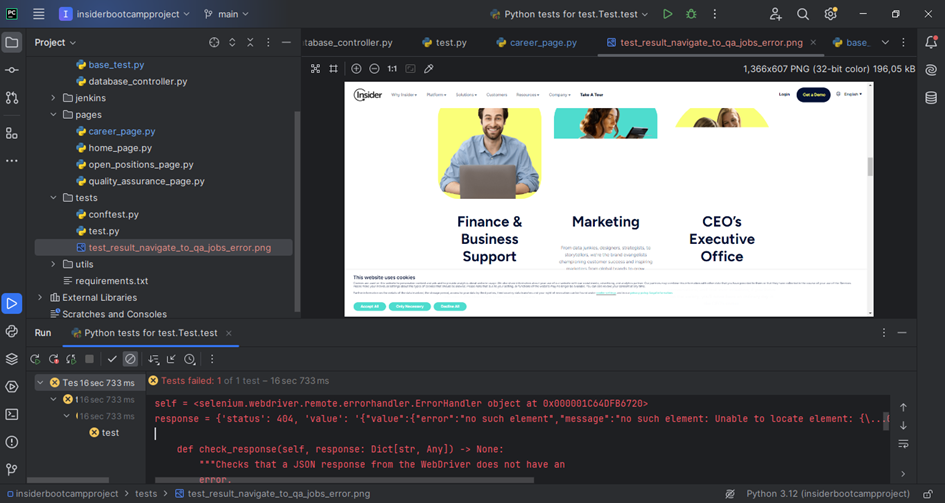
- Organized using the Page Object Model (POM) design pattern.
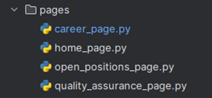

### Task Instructions:
1. Navigate to Insider's Homepage to verify its accessibility.
2. Select "Company" from the navigation bar, then "Careers" and verify if the Career page, including its Locations, Teams, and Life at Insider sections, are accessible.
3. Visit the Quality Assurance Careers Page, click "See all QA jobs", filter the jobs by location (Istanbul, Turkey) and department (Quality Assurance), and check for the job listings' presence.
4. Ensure each job position lists "Quality Assurance" in both the Position and Department fields and "Istanbul, Turkey" in the Location field.
5. Verify that clicking the "View Role" button redirects to the Lever Application form page.

## CI/CD Pipeline Integration

### Tasks:
- Establishes a CI/CD pipeline using [CI/CD tool].
- Configured to initiate tests for new pull requests or when changes are pushed to an existing pull request.
- Generates and stores test reports and screenshots after each test run.
- Integrates test results as required checks for pull requests.  

**Credentials:**
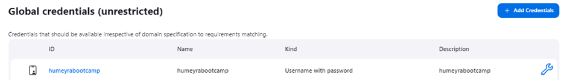

**Pipeline configurations:**
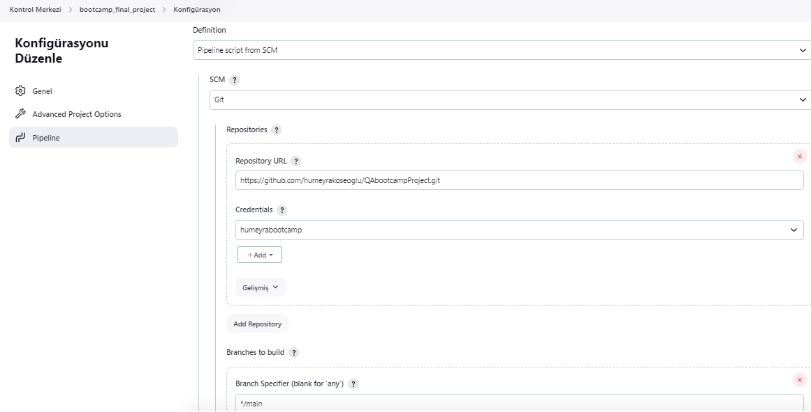
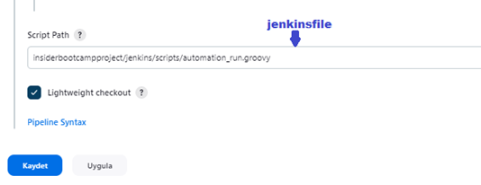

**Build pipeline with parameter:**
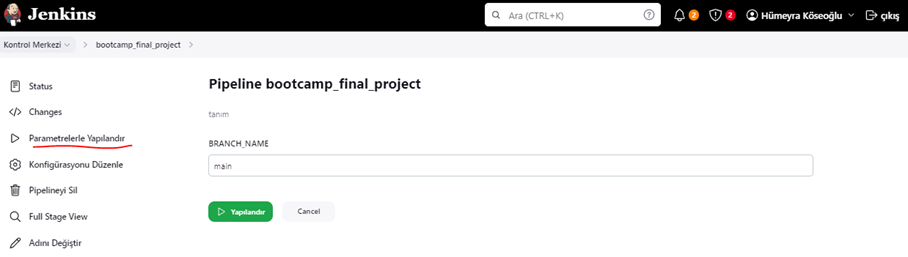

**Stage view:**

 

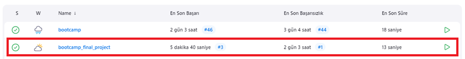

## Test Results Visualization
- Logs test results into a chosen database (e.g., MySQL, PostgreSQL, MongoDB).
- Sets up Grafana and integrates it with the database to visualize testing metrics.
- Develops Grafana Dashboards displaying test metrics such as pass rates and execution times.

### DATABASE:
I saved the test results in the database with properties such as case name, path,  status, stake trace and duration. I created a database and table for this. I used MySQL.
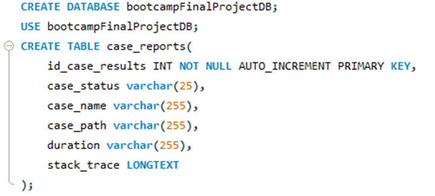
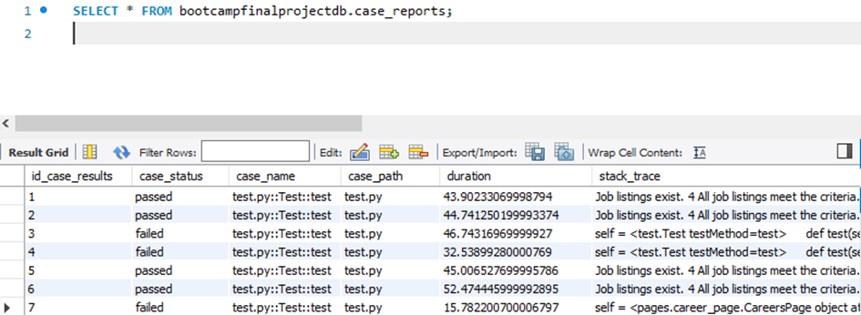

### GRAFANA
1. Install Grafana on your server.
2. Configure Grafana to connect to the chosen database where test results are logged.
3. Create dashboards in Grafana to visualize test metrics such as pass rates and execution times.

`GRAFANA JSON FILE :`
Insider Bootcamp Project-1711138171051.json 

`GRAFANA SCREENSHOTS :` 
**•	Gauge View**
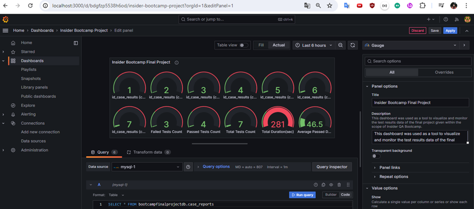

**•	Stat  View**
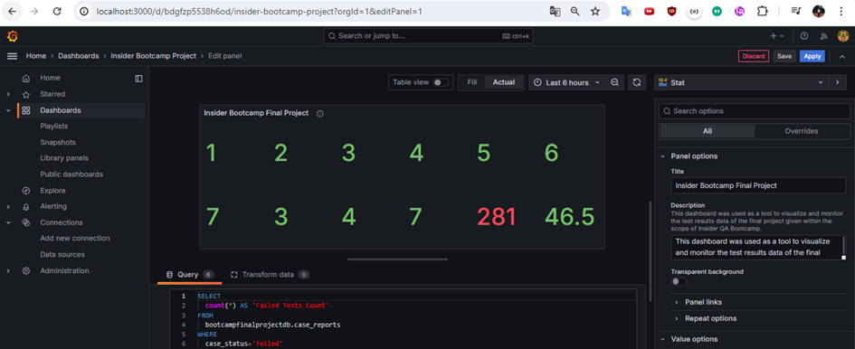

**•	Piw Chart View**
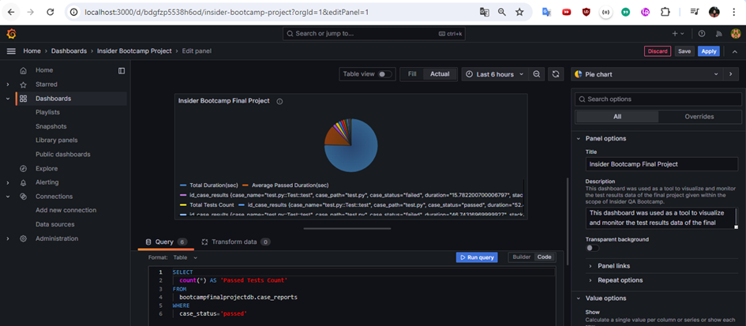

**• Bar Gauge View**
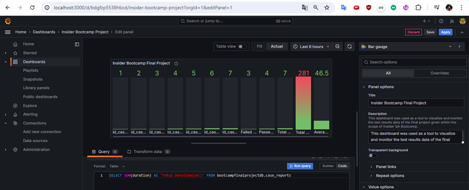

## Test Execution Summary
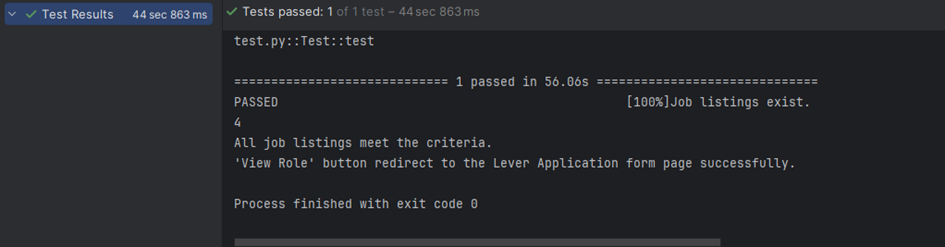

- Total Tests: 7
- Passed: 4
- Failed: 3
- Average Duration: 45.6 seconds

### Test Cases
**Test 1: Verify Accessibility of Insider's Homepage**
- Status: Passed
- Description: The homepage of Insider was successfully accessed and loaded.

**Test 2: Verify Accessibility of Career Page**
- Status: Passed
- Description: The Career page, including its Locations, Teams, and Life at Insider sections, were successfully accessed and loaded.

**Test 3: Verify Accessibility of Quality Assurance Careers Page**
- Status: Passed
- Description: The Quality Assurance Careers page was successfully accessed and loaded.

**Test 4: Verify Filtering of QA Jobs by Location and Department**
- Status: Passed
- Description: QA jobs in Istanbul, Turkey, under the Quality Assurance department were successfully filtered and displayed.

**Test 5: Verify Redirection to Lever Application Form Page**
- Status: Passed
- Description: Clicking the "View Role" button redirected to the Lever Application form page.

## Screen Recording
Link: https://drive.google.com/file/d/1iemTpkm7vA6-ltQVpMh0Cs4GY2X2kRfF/view?usp=sharing

All test cases passed successfully.

